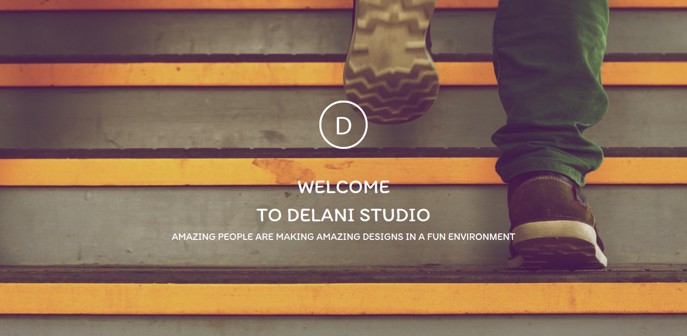

# Delani Studio
## Description
This is a web application which features a landing page for a fictional studio, Delani Studio. The application includes a brief description of the studio, the services it offers, some of the projects it's worked on and its contact information. It also incorporates user experience where the user can click on the 'What we do' icons to toggle between the icon's descriptions as well as hover over the images of the projects to display their names. 
 
Date of current version:27-12-2021
#### By **Soila Pertet** 
### Screenshot

## Live demo
https://soilapertet.github.io/delani-studio/
## Setup/Installation Requirements
* On the main page of the git repository,navigate to the button that says "Code" and copy the URL by      clicking on the clipboard button next to the URL.
* Open the terminal by clicking Ctrl+Alt+T
* Use the git clone command to create local repository containing the copy of the git repository: git clone +(the URL you copied)
* Open the local repository in the code editor of your choice.
* Open the live server to access the web applcaition. This is based on the assumption that you've installed 
  the 'Live-Server'(for VS code) or 'atom-live-serve'(for Atom). Here are some useful websites to get you started:
  <a href="https://stackoverflow.com/questions/50210151/how-to-launch-atom-live-server-step-by-step">How to launch Live Server on Atom</a> or
  <a href="https://www.freecodecamp.org/news/vscode-live-server-auto-refresh-browser/">How to launch Live Server on VS Code</a>

## Known Bugs
* The pop-up subcription form does not display as required.
## Technologies Used
Languages used:
* HTML
* CSS
* JavaScript
 
Code editor used:
Visual Studio Code

## Support and contact details
If you run into any bugs or issues when running the code, feel free to reach out to me using the following email address(es):
<em>soila.pertet@student.moringaschool.com</em> or <em>nicolepertet@gmail.com</em>

### License
*MIT License*
Copyright (c) 2021 **Soila Pertet**
